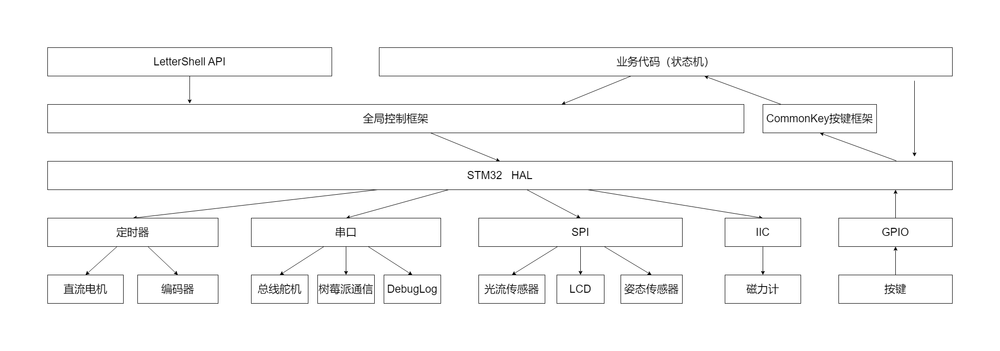
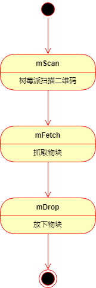

# 工训赛软件工程分析----一份送给刚陷入自控软件泥潭者的小礼物

## 碎碎念

之前参加工训赛其实是抱着想要把这个比赛打完的想法的，但是中途突然收到了老师的通知得知比赛实际的举办时间已经推迟到了12月，对于我们队伍中的三个人来说都是一个噩耗，所以无奈只好放弃了这个比赛。

我们之前的项目给到了学弟手中，由我经手的代码也已经悉数开源到[这里](https://gitee.com/zhewana/2023-Work-training-competition-software)了，希望学弟带着我的遗志（bushi）继续努力下去！

工训赛的工程其实是笔者写的相对比较认真的工程，有些地方略显青涩，但是值得一说（吧？）。再加上笔者自己也恰好有需要分析这个项目的需求，遂写了这篇文章。

> 老油条须知：本文不是为老油条准备的，看着玩就行，不足之处轻喷，谢谢：）
>
> 另：本文中会对部分概念进行简单解释，均在引用块中进行。

---

副标题其实是笔者后续添加的（尽管没体现在更新记录中），因为总结完整个代码之后发现其实整个工程还是比较小，为了能多水些字数所以打算加一点简单的概念解释进去。

## 软硬件平台

控制器：STM32H750VBT6

开发环境：使用Clion作为编辑器，使用AC6工具链进行编译

## 代码结构与分析

这个工程和以往的工程最大的不同其实是笔者**有认真的思考过整个代码的软件架构应该如何进行组织**，包括但不限于：

* 硬件接口应该如何定义
* RTOS和中断应该如何进行权衡
* ......

上述问题笔者可能会在接下来的内容中展开说明，也可能不会（毕竟有些东西笔者自己也不清楚应该如何表达），但是笔者会尽量把整个工程讲述清楚。

先来看一张大概的结构图：



这个结构图大致描述了整个控制器工程的代码架构，笔者将其整体分为四层：**应用层（1）->框架层（2）->驱动层（3）->硬件层（4）**

该分层只是笔者自己当前阶段认为的分层方式，可能并不完善，甚至包含错误，**仅作参考**。

笔者在框架的组织中使用到了RTOS，但是在结构图中切并没有出现RTOS的身影，请别疑惑。笔者认为，RTOS这种无感的调度方式使得其并不适合被放在系统的架构图中，而更应该出现在软件开发的细节中。

这并不是说RTOS是无用的，恰恰相反，**能做出这种无感的设计才是更可贵的**，因为它的存在并没有让我们的系统分析变得更加复杂。

### 应用层代码

严格来讲，工训赛这个工程并不算是一个产品而是一套自动化的流程，所以其实会缺少一些产品才会有的属性，比如：良好的人机交互系统。

但是在实际使用中为了方便调试，笔者还是引入了[LetterShell](https://github.com/NevermindZZT/letter-shell)这样的命令行交互系统来进行参数的调节和一些选项的设置。并且由于shell操作和自动化运行其实是完全互相独立的关系，所以可以在架构图中看到：LetterShell提供的方法和实际的业务代码是同处应用层中的两个不同部分，他们直接面向用户（需求），实现最终的功能。

**显而易见的：应用层代码是随需求变化而变化的。**

#### 自动化运行相关代码

最典型的应用层的代码集合应该是 `static void __RunMainState(void)----utils.c:55`

> PS：笔者在此处以及后文将会使用类似的语法：`行代码----文件名:行数`来导航到一些过长不便展示的函数或代码。

这个函数实际是一个状态机的实现，用来描述整车的状态流程：



尽管实际上整车的状态流程就是一个简单的线性流程，完全可以直接在函数中直接执行，但是笔者还是使用了状态机来进行组织，以应付后续可能会出现的更加复杂的需求。

> 状态机是一种简单的程序实现方式，在近几年自控的赛题中十分常见。通常用状态和状态转移来描述一个状态机。而最常见且简单的状态机实现方式其实就是使用switch语句，将状态和状态转移条件以及行为都包含在分支内。
>
> 对于状态的定义，笔者建议使用枚举的方式，因为使用宏定义的方式让本互相之间有关联的状态变得互不相干（说白了就是笔者不喜欢😑
>
> PS：尽管大家似乎都不屑于进行状态机编程，但是这并不影响状态机是一个良好的方法。

该状态机运行在由FreeRTOS所调度的一个任务中 `void StateMachineEntry(void *argument)----freertos.c:281`：

```c
void StateMachineEntry(void *argument) {
    /* USER CODE BEGIN StateMachineEntry */
    UNUSED(argument);
    /* Infinite loop */
    for (;;) {
        if (CarInfo.Start_State) {
            CarInfo.RunMainState();
        }
    }
    /* USER CODE END StateMachineEntry */
}
```

启动状态机调度的标志位由一个按键通过按键框架进行控制，以实现按下按键就能开始自动运行的功能。

#### LetterShell API相关代码

LetterShell中只实现了调试用得到的6个指令：

|                               指令                               |          功能          |
| :---------------------------------------------------------------: | :--------------------: |
|                 set`<paraname paravalue>` ...                 |  设置paraname参数的值  |
| motormove`<axis-y-value>` `<axis-y-value>` `<speedlimit>` | 基于车体坐标系进行移动 |
|  mapmove`<axis-y-value>` `<axis-y-value>` `<speedlimit>`  | 基于世界坐标系进行移动 |
|                           rota`<dig>`                           |        旋转车身        |
|                                ed                                |    关闭串口数据输出    |
|                                op                                |    打开串口数据输出    |

#### 接口相关代码

应用层实现所用的接口实际大致可以分为两种：**框架层接口**和**驱动层接口**

其中驱动层接口一般用于比较简单的硬件设备的驱动，例如总线舵机相关的代码 `utils.c:304`：

```c
/**
 * @brief 夹子电机旋转(夹子开关)
 * @param position 舵机位置单位(0-1000)
 * @param time 运行所需时间(单位:ms)
 */
void ClipRotition(float position, uint32_t time) {
    LobotSerialServoMove(ClipServoID, (int16_t) position, time);
}

void ClipCloseForOS(void) {
    ClipRotition(CLIP_CLOSE, 700);
}

void ClipOpenForOS(void) {
    ClipRotition(CLIP_OPEN, 700);
}
```

而框架层的接口则是由框架层直接提供出来用来操控整车运动的，我们在下一节详叙。

### 框架层代码

框架层是应用层的基础，是基于驱动层所实现的与应用无关的通用功能模块。

该工程的框架层主要涉及两个框架，一个通用的按键框架以及一个具有相对专用功能性的麦克纳姆轮小车控制框架。

通用按键框架已经开源在[这里](https://github.com/Zhewana/CommonKey)，就不再赘述了。以下着重分析麦克纳姆轮小车的控制框架，先来看看控制框架部分的整体程序结构：


框架相关的部分主要有两个任务和一个定时器中断，其中一个屏幕刷新任务我们可以忽略，那么剩下来的两部分本质上就是由一个中断和一个循环所组成的**前后台架构**。

> 前后台架构是在嵌入式软件开发过程中十分常见于裸机开发中的一种架构，通常由一个定时器中断和一个主循环构成。
>
> 使用这种架构的初衷是：**避免在中断中处理过于繁杂的任务进而导致中断衔尾**，于是便把需要处理的任务搬到主循环中处理。实际使用中往往会为在主循环中的轮询的代码设置一个标志位，在中断中把标志位置位，接着在主循环中清除该标志位并执行需要执行的任务（没错，就是仿照实际中断的运行方式）

既然涉及到了中断那自然少不了带中断软件的设计准则：**中断中的程序应该尽量短小**，所以一切涉及IO的操作自然就要移动到阻塞不敏感的循环中。再加上使用RTOS进行代码执行，所以原来的标志位也就自然而然的改为了消息队列的实现 `main.c:386`：

```c
void HAL_TIM_PeriodElapsedCallback(TIM_HandleTypeDef *htim) {// 1ms IRQHandler
    static enum SensorType {
        sCompass,
        sGyro,
        sOptical,
    } SensorType;

    // Get compass
    SensorType = sCompass;
    osMessageQueuePut(SensorMessageQueueHandle, &SensorType, 0, 0);

    // Get gyro
    SensorType = sGyro;
    osMessageQueuePut(SensorMessageQueueHandle, &SensorType, 0, 0);

    // Divide Timer Freq
    static int cnt = 0;
    const int period = 10;
    if (++cnt == period) {
        cnt = 0;
        // Get position
        SensorType = sOptical;
        osMessageQueuePut(SensorMessageQueueHandle, &SensorType, 0, 0);
    }
}
```

以上代码虽然是实际代码的部分截取，但是实现的功能与实际执行相同：以固定的时间间隔读取传感器采集的数据。其中消息队列与传感器采集任务通讯，一旦采集任务接收到对应传感器类型的消息就会立即开始数据采集工作 `void SensorHandleEntry(void *argument) {----freertos.c:340`。

### 硬件接口

外设驱动层主要是由厂商实现的，所以笔者直接跳过了这部分的说明，毕竟你都看到这里了，应该不至于不了解HAL。

笔者此处相间的东西其实也很简单：通过**添加一个中间层的方式**来将软件逻辑和硬件逻辑来进行隔离。在motor.c中就有一个很简单的例子：

```c
int Motor_Drive(int motorID, float duty, int dir) {
    static TIM_TypeDef *TIMx[5] = {TIM12, TIM16, TIM12, TIM15, TIM15};
    static volatile uint32_t *CCRx[5] =
            {&TIM12->CCR1, &TIM16->CCR1, &TIM12->CCR2, &TIM15->CCR1, &TIM15->CCR2};
    static GPIO_TypeDef *GPIOx[5] =
            {Dir2_GPIO_Port, Dir3_GPIO_Port, Dir1_GPIO_Port, Dir4_GPIO_Port, DirStep_GPIO_Port};
    static const uint32_t GPIO_Pinx[5] = {Dir2_Pin, Dir3_Pin, Dir1_Pin, Dir4_Pin, DirStep_Pin};

    uint32_t pinState = 0;

    if (duty > 100)duty = 100;
    else if (duty < 0)duty = 0;

    if (motorID == 0 || motorID == 3)
        pinState = dir;
    else
        pinState = !dir;

    *CCRx[motorID] = (uint32_t) ((float) (TIMx[motorID]->ARR) * duty / 100);
    HAL_GPIO_WritePin(GPIOx[motorID], GPIO_Pinx[motorID], pinState);

    return 0;
}
```

通过定义一个**硬件相关的句柄列表**的方式将所有需要控制的电机全部集成到一个统一的接口中，这样当你的硬件队友大改硬件时，你就只需要修改这个函数中的对应引脚表了。~~（硬件不要大改最好~~

## 架构之外

在代码架构之外其实还是有那么一些问题和一点特殊的代码段值得关注，这些内容中的一小部分可能算是一点小巧思吧，不过往往不是什么通用的经验，所以简单介绍一下算了。

### RTOS与中断的权衡问题

> RTOS的全称是实时操作系统，其主要实现的功能包括但不限于：多任务的竞争或合作式调度、任务间通信机制（信号量、消息队列）等。
>
> RTOS的核心是**调度**，我们使用到它的最大原因是：它可以通过调度的方式来让单核的MCU以一种伪并行的方式来运行多个任务。

在嵌入式系统的实际使用中，尽管使用了RTOS，中断也是没法绕开的重要部分。不过在一开始接触RTOS的时候笔者一直将其**作为代替前后台架构的良好解药**，但是经过一番思考与实践之后笔者发现事情貌似并不是这样的。

RTOS的任务调度之间往往有任务优先级，而不同中断之间也是有优先级的；RTOS和中断的高优先级都会无情的打断低优先级的执行。但是两者实际**并不冲突**。就拿使用频率最高的定时器中断来说：在FreeRTOS中似乎也做出了尝试取代定时器中断的设计：**软件定时器**，但是勇敢的读者你要知道，RTOS的调度**并不是毫无成本的调度**，所以这种软件上的定时器往往没法保证其精度。

另一个值得注意的点是：虽然RTOS具有打断任务执行的能力，但是稍微了解一下你就会知道：**RTOS的这种能力往往也是来自于中断**，最典型的就是在Arm内核中往往来自于内核提供的SysTick中断。而这个中断在实际应用中为了防止系统故障导致重大问题，往往会将其优先级设置为最低。这说明了什么？**中断具有打断RTOS执行的能力。**

换句话说，虽然RTOS被称为实时系统，但是实际的实时性维护还是基于中断的，**RTOS只是通过调度的方式把原来前后台架构中后台的部分做的更好了而已。**

~~一不小心写多了，抱歉，下次还敢~~

### 作用于同一执行器的多个PID的数据融合问题

这个问题严格来讲其实对于跻身自控泥潭很久了老油条来说往往不是什么问题吧，甚至很多大佬应该有优于笔者的解决方案，不过就当是讲给新手了。

在我们进行PID控制的过程中，绝大部分PID的输出都是直接对应到执行器上，对其进行控制的，但是难免会有这样尴尬的局面：两个PID的输出需要作用到同一个执行器上。

最典型的场景就是：你需要控制一个两轮小车进行运动，包括前进后退以及转向。在分开的情况下一切都是容易的，但是当你需要一边前进一边转向的时候你就会开始懵逼了。

当然，方案其实是简单的，只要把两个PID的输出线性相加到同一缓冲个变量中然后进行输出即可，如果还是不太理解的话可以读一读定时器中断中相关的代码 `main.c:485`：

```c
// Merge Motor Position PID and Attitude PID output
switch (i) {
    case 1:
    case 2:
        CarInfo.msPid[i].ctr.aim =
                (CarInfo.mPsiCtr ? CarInfo.mpPIDout[i] : CarInfo.spdAim[i]) + CarInfo.avPidOut;
        break;
    case 0:
    case 3:
        CarInfo.msPid[i].ctr.aim =
                (CarInfo.mPsiCtr ? CarInfo.mpPIDout[i] : CarInfo.spdAim[i]) - CarInfo.avPidOut;
        break;
    case 4:
        CarInfo.msPid[i].ctr.aim = CarInfo.mpPIDout[i];
        break;
}
```

当然，直接线性相加的方法在两个环输出都比较高的情况下往往会造成输出进而失真，可以用软件的方式在没有失真的另一侧进行补偿，但是没有必要也不严谨，真想了解这方面的内容建议寻求专业人士帮助。

### 光流传感器的数据修复问题

在实际使用的过程中，笔者使用的光流传感器一旦面对纯黑色的材质就会失效，不巧的是在测试的场景中黑色部分甚多，因此一旦到达黑色材质的部分，光流传感器的数据将不再更新，进而让闭环算法认为自己的位置没有发生变化，最终导致整车在积分的作用下加速在黑色区域中失控行驶。

这已经不是简单的传感器数据误差了，而是实实在在的传感器故障。

当然，问题的出现就是要让人去解决的，只要抓住主要矛盾就能解决问题。而这个问题中的主要矛盾就是：光流传感器的数据是不变的，而车子本身的速度是变化的，甚至会变化的更加猛烈~~（物理矛盾）~~。

转换一下问题就是：在传感器失控的时候，通过速度计算的位移和通过光流计算获得的位移的差是更大的。并且，在传感器没有是空的情况下，传感器更准，否则通过自身速度积分获得的位移更准，刚好符合互补滤波的使用条件（或许需要一些想象力：）

于是笔者简单的写了一个系数变化的互补滤波，用来修复传感器的错误数据 `freertos.c:378`：

```c
// Recalculate optical confidence for each axis
float tempDx = fabsf(CarInfo.dx),
        tempSx = fabsf(ToPMWSystem(CarInfo.spdX)),
        tempDy = fabsf(CarInfo.dx),
        tempSy = fabsf(ToPMWSystem(CarInfo.spdX));
if (MAX(tempDx, tempSx) != 0) {
    CarInfo.opticalConfigX = MIN(tempDx, tempSx) / MAX(tempDx, tempSx);
} else {
    CarInfo.opticalConfigX = 1;
}
if (MAX(tempDy, tempSy) != 0) {
    CarInfo.opticalConfigY = MIN(tempDy, tempSy) / MAX(tempDy, tempSy);
} else {
    CarInfo.opticalConfigY = 1;
}
// Fusing optical data and car speed data
CarInfo.curX += CarInfo.dx * CarInfo.opticalConfigX
                + (1 - CarInfo.opticalConfigX) * ToPMWSystem(CarInfo.spdX) * 0.01f;
CarInfo.curY += CarInfo.dy * CarInfo.opticalConfigY
                + (1 - CarInfo.opticalConfigY) * ToPMWSystem(CarInfo.spdY) * 0.01f;
```

实际测试效果还好，恭喜自己。
